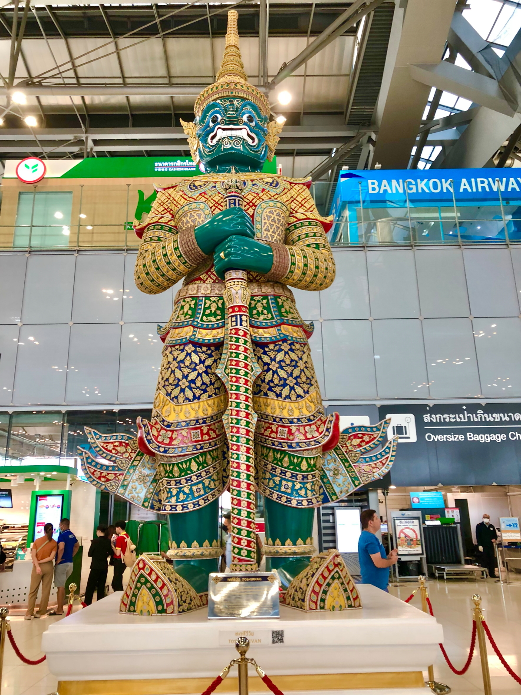

# 2024Jan_Thailand__5

<html>
<head>

<meta charset="UTF-8">
<meta http-equiv="Content-Type" content="text/html; charset=UTF-8">
<meta http-equiv="X-UA-Compatible" content="IE=EmulateIE10" />
<meta http-equiv="X-UA-Compatible" content="IE=edge">

<!--ここから上はお決まりの定型文です-->

<!--ここからが表現の書式などを決めるcssという部分-->

<link href="https://cdnjs.cloudflare.com/ajax/libs/lightbox2/2.7.1/css/lightbox.css" rel="stylesheet">

</head>

<body>

モバイル端末をお使いの場合は、画面を横向きにすると
より見やすくご覧頂けます。

<!--ここ上は、ほぼそのまま使います！-->

<!--QRコードの挿入例-->

 アクセス用QRコード

<marquee direction="left" scrollamount="20" width="30%">(^_^)/~hada</marquee>

<!--流れ文字の挿入例-->
<h1><marquee behavior="left">!!! 2024/01/06 、バンコクからチェンライに移動 !!!</marquee></h1>

<a href="https://torokoid.github.io/2024Jan_Thailand/">Thailand</a>><a href="https://torokoid.github.io/2024Jan_Thailand_2/">Thailand_2</a>><a href="https://torokoid.github.io/2024Jan_Thailand_3/">Thailand_3</a>><a href="https://torokoid.github.io/2024Jan_Thailand__4/">Thailand__4</a>>Thailand__5

                 

<!--ここから下が、本体部分-->
 
タイ観光

<h2>6日はバンコクからチェンライに移動すべく、スワンナプーム国際空港に移動！</h2>

<h2>空港内では白人さんが目立ちます</h2>

<h2>赤鬼と青鬼のオブジェが仁王立ち</h2>

<h2>赤鬼と青鬼の足元にある説明書を撮影したら、それぞれの鬼さんのHPに飛びます</h2>

<h2>搭乗ゲートに向かいます</h2>

<h2>空港内には王室直営店</h2>

<h2>王家の農場などで採れた収穫物の販売で、価格は民間企業では太刀打ちできないレベル</h2>

<h2>タイ空港の搭乗口エリアにつきました</h2>

<h2>早めに着いたのでお客さんはまばら</h2>

<h2>搭乗口もまだ無人でした</h2>

<h2>18:50発の夜間飛行なので、バンコクの夜景が見えます</h2>

<h2>バンコクの夜景動画</h2>
<iframe width="560" height="315" src="https://www.youtube.com/embed/gI0SHTpktH4?si=9QYZH0W1I_E15wzM" title="YouTube video player" frameborder="0" allow="accelerometer; autoplay; clipboard-write; encrypted-media; gyroscope; picture-in-picture; web-share" allowfullscreen></iframe>
<h2>機内食はズッシリとしたサンドイッチと水</h2>

<h2>70分程でチェンライ国際空港に到着</h2>

<h2>チェンライ到着の動画</h2>
<iframe width="560" height="315" src="https://www.youtube.com/embed/1buvjIPzS64?si=eh-r95rJREvQi5aY" title="YouTube video player" frameborder="0" allow="accelerometer; autoplay; clipboard-write; encrypted-media; gyroscope; picture-in-picture; web-share" allowfullscreen></iframe>
<h2>チェンライ国際空港です</h2>

<h2>移動したのはタイの北端部</h2>

<h2>途中でセブンイレブンに寄りました</h2>

<h2>店から出ると、周囲の車は全部吐けてしまってました まだ夜の８時過ぎですがバンコクとは大違い</h2>

<!--
  
以下写真集！

1月2日はバンコクからパタヤまでお出かけしました。

-->

  

      

<!--本体はここまで-->

<!--画面に空白地帯を作って、背景が見えるようにしています-->
                                              

<!-- フッタ -->
<footer>

Copyright 2024/01/06 S.Hada

</footer>

<!--HPにさまざまなJavaScriptを呼び込むための書式-->

